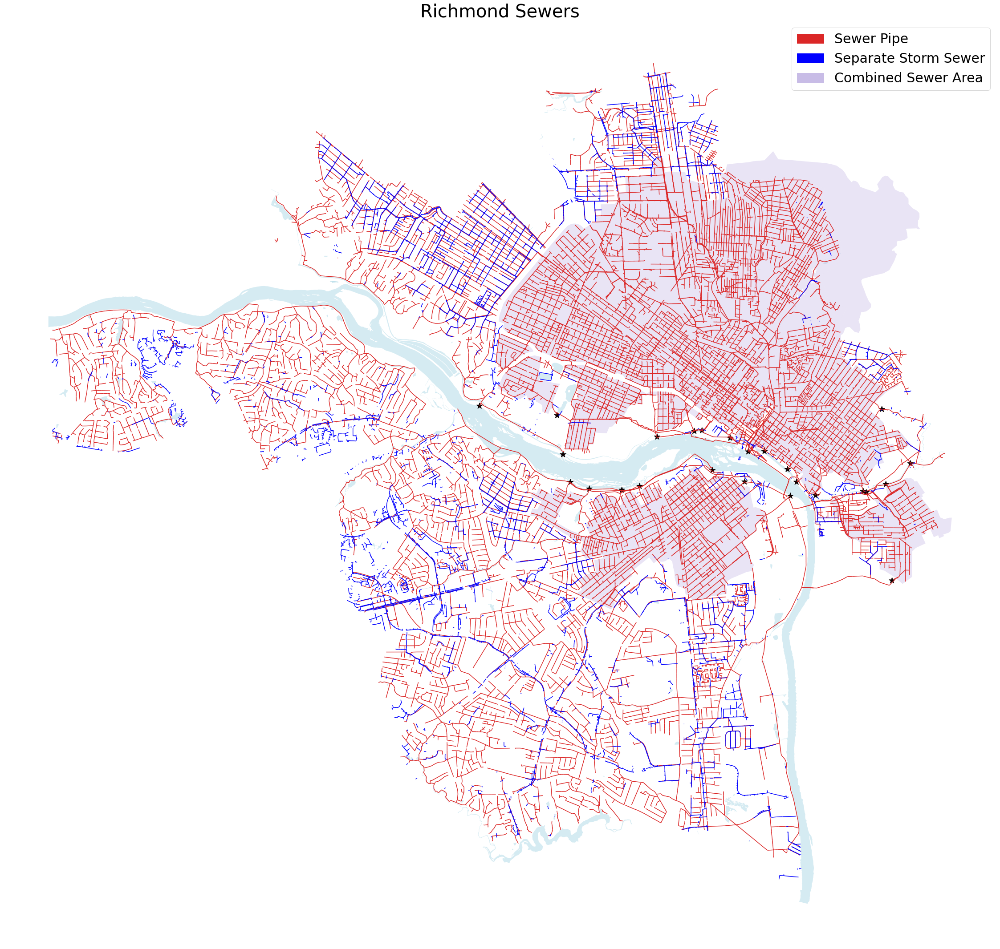
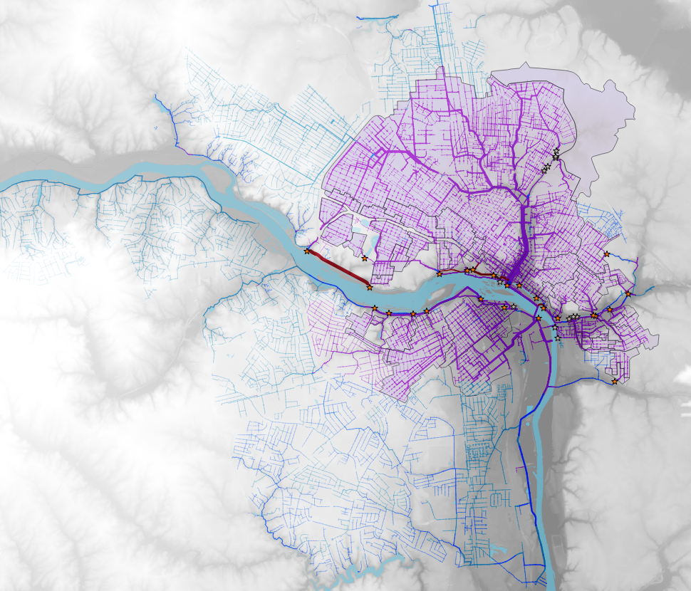

# Richmond VA Sewer Systems

The Richmond Department of Public Utilities supports both the [Wastewater Utility](http://rva.gov/public-utilities/wastewater-utility) and [Stormwater Utility](https://rvah2o.org/). Like many older cities, it has a large [combined sewer system](https://rvah2o.org/combined-sewer-system/) which sometimes results in *combined sewer overflow* events, where wastewater ends up in the river.

I couldn't find an easily accessible dataset of the Richmond sewer pipes, but I found some [GIS layers](https://www.arcgis.com/home/search.html?q=owner%3A%22DOEE_GIS%22&t=content&restrict=false) published by [the DOEE, who have done some detailed TMDL documents](https://doee.dc.gov/service/total-maximum-daily-load-tmdl-documents) about bateria levels in waterways, and was able to convert them into a more usable format.

Notes:

* shapefile.zip - If you're a GIS mapper, just download this and unzip it. It currently has 4 layers - the CSO boundaries, the storm drain system, the sewer sytem (both separate and combined), and the CSS outfalls. 
* sewer_maps.ipynb - If you're a python developer, I did most of my coding here.
* sewer.gqs - This QGIS project file has some colors and formatting.
* Basemap/ - these files are from [Richmond GIS FTP](ftp://ftp.ci.richmond.va.us/GIS/Shapefiles/Basemap/)

I also found it interesting to combine some elevation data - I used the [National Map Downloader](https://apps.nationalmap.gov/downloader/) to grab "USGS 1/3 Arc Second n38w078 20210305" and cropped it to fit.

